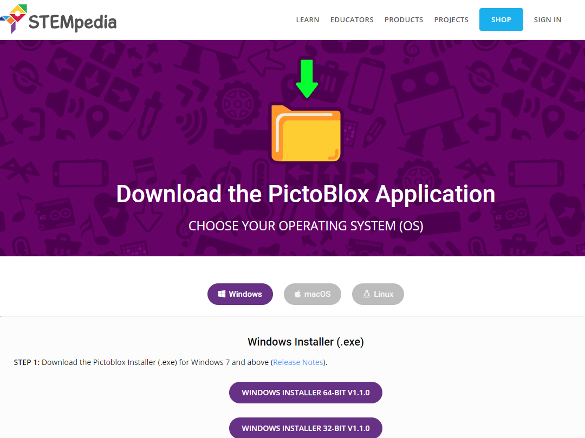
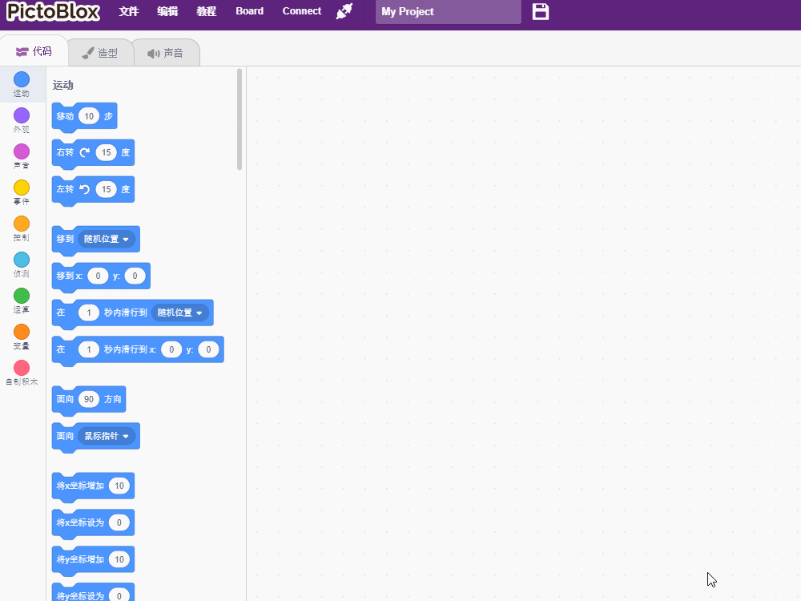
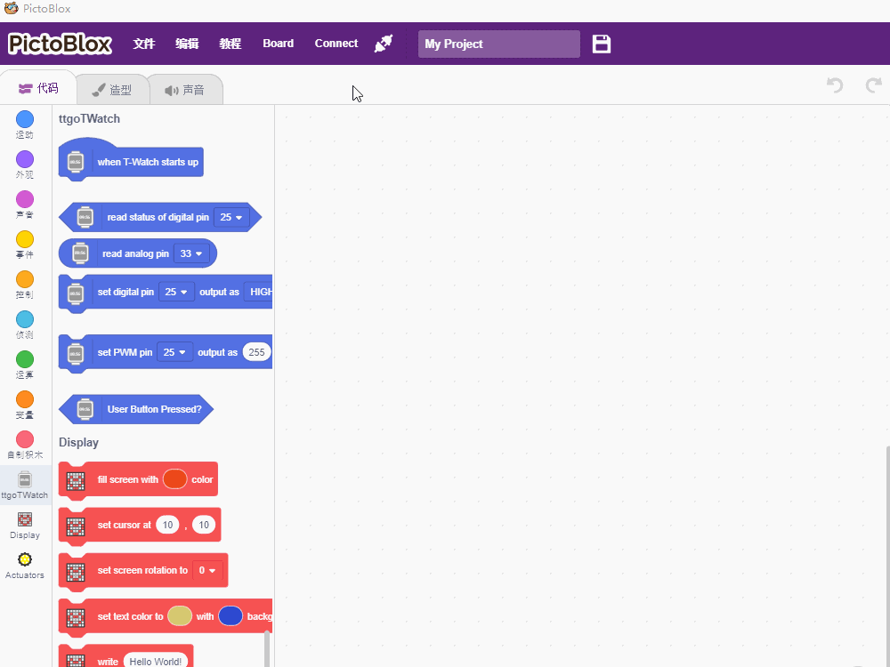
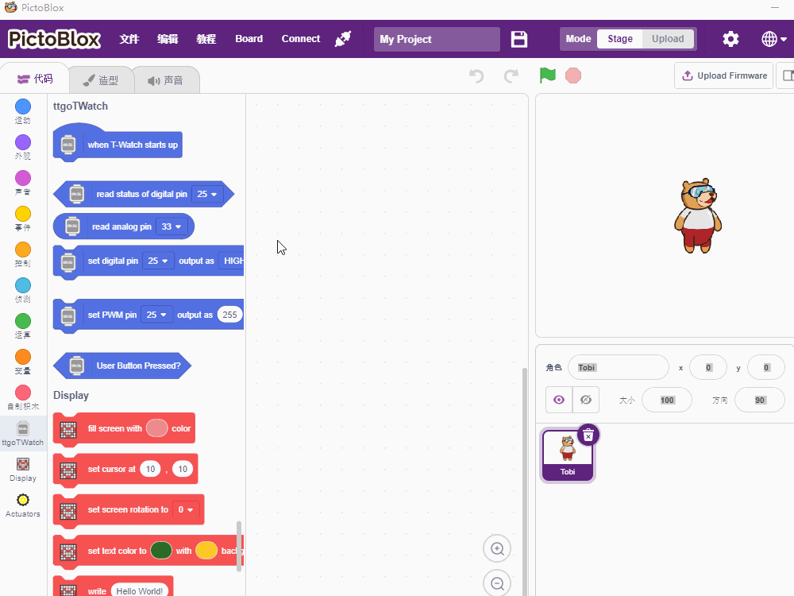
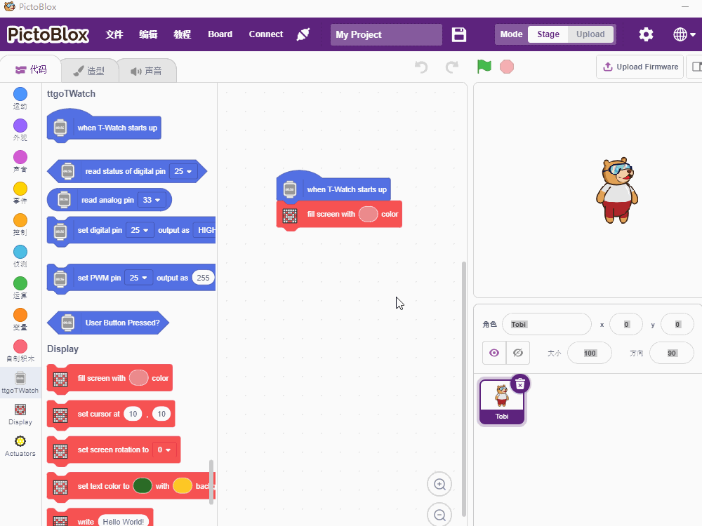
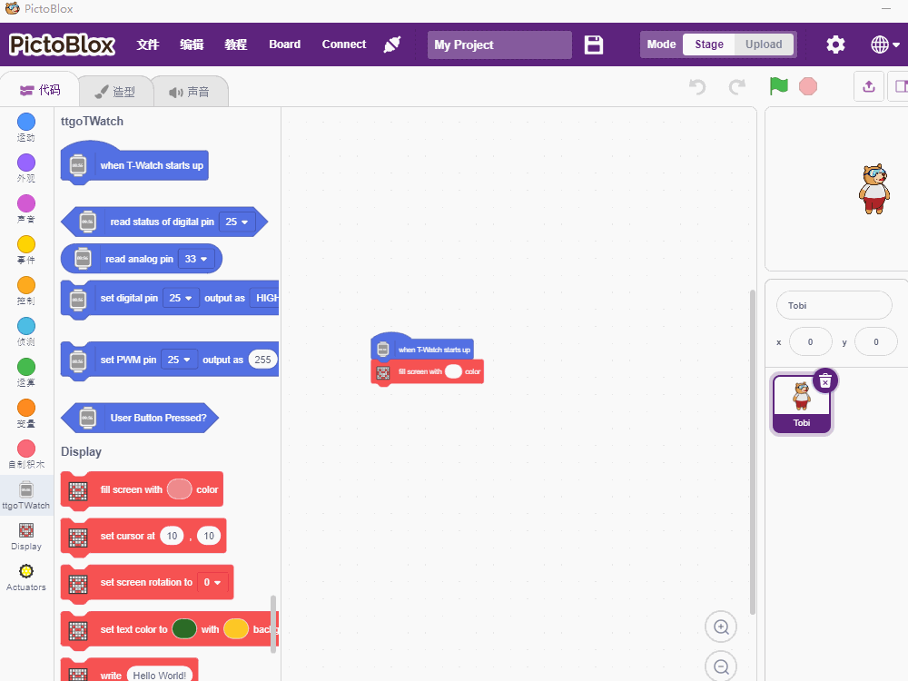

=============
快速上手
=============

本文档旨在指导用户如何安装PictoBlox编程软件，以及基础操作

一. 环境搭建
=============

操作步骤
+++++++++++++
* :ref:`get-stared-download`
* :ref:`get-stared-install`

.. _get-stared-download:

1. 软件下载
==============

1.1 直接下载
+++++++++++++++++++++++++

+-------------------+-------------------+-------------------+
| |windows-logo|    | |linux-logo|      | |macos-logo|      |
+-------------------+-------------------+-------------------+
| `Windows`_        | `Linux`_          | `Mac OS`_         |
+-------------------+-------------------+-------------------+

.. |windows-logo| image:: ../_static/windows-logo.png
    :target: ../basics/windows-setup.html

.. |linux-logo| image:: ../_static/linux-logo.png
    :target: ../basics/linux-setup.html

.. |macos-logo| image:: ../_static/macos-logo.png
    :target: ../basics/macos-setup.html

.. _Windows: ../basics/windows-setup.html
.. _Linux: ../basics/linux-setup.html
.. _Mac OS: ../basics/macos-setup.html

1.2 官网下载
++++++++++++++++

登陆 `Pictoblox <https://thestempedia.com/product/pictoblox/download-pictoblox/>`_ 选择与操作系统相对应的软件版本

.. _get-stared-install:

2. 软件安装
==============

二. 快速上手
=============
1.打开软件
=============

.. note::
    双击桌面Pictoblox图标，运行软件。

2.连接操作
=============

2.1 选择开发板类型
+++++++++++++++++++

.. note::
    点击菜单栏中的 ``board`` ,然后选择 ``T-Watch``  

2.2 USB连接T-watch
+++++++++++++++++++
.. image:: ../_static/model2.jpg
.. note::
    使用Type-C数据线连接T-Watch的Type-C接口，位置如上图，在手表 ``右侧``  

2.3 选择端口
+++++++++++++++++++

.. note::
    点击菜单栏中的 ``Connect`` ,然后选择生成的 ``COMXX``  

3. 上传程序 
=============

3.1 选择积木
+++++++++++++++++

3.2 调节参数
+++++++++++++++++

3.3 上传程序
+++++++++++++++++

3.4 正常运行
+++++++++++++++++