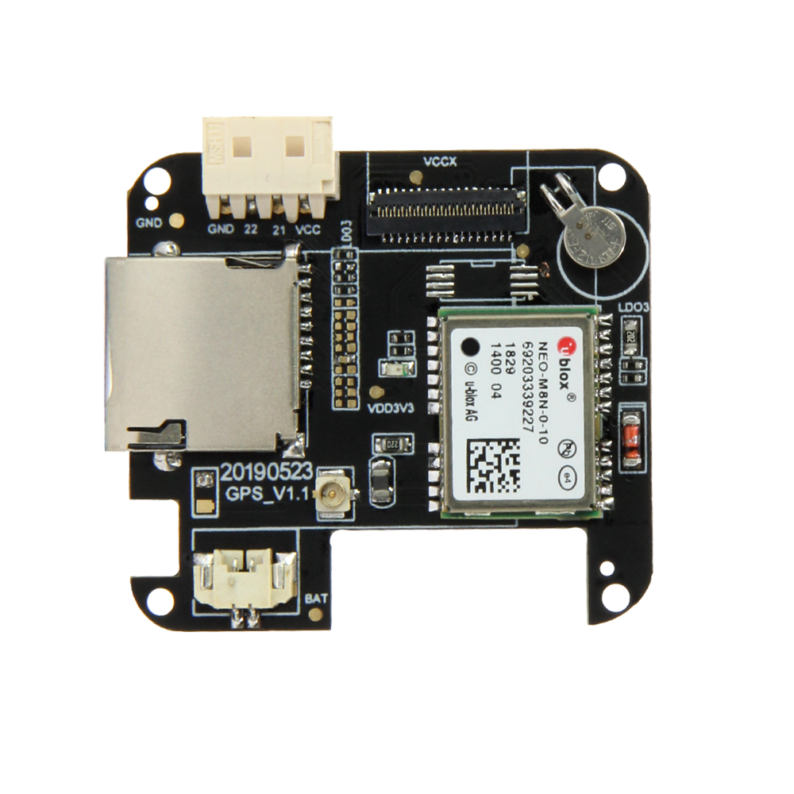
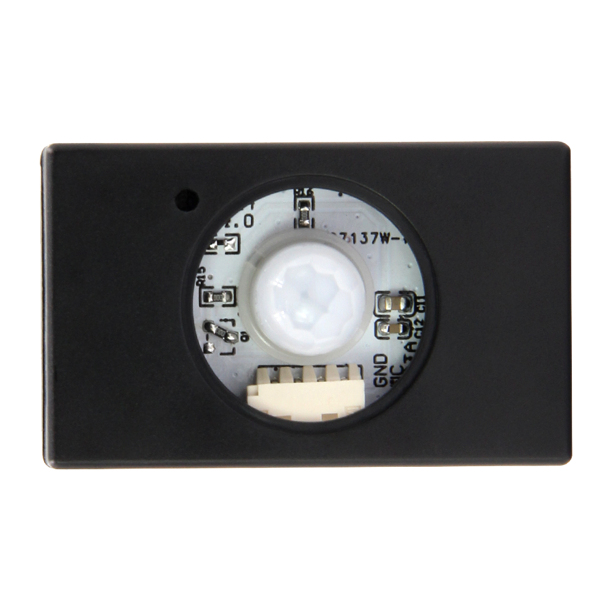

==============
简介
==============

.. image:: ../_static/1.jpg

软件概述
==============

PictoBlox是基于Scratch 3.0的图形化编程软件，是迈向编程世界第一步的理想伴侣。 
其用户友好的界面和拖放功能消除了存储语法和规则的需要，而这是传统编程语言中经常遇到的情况，
并且常常使孩子感到恐惧并使他们犹豫。 结果，他们只需要专注于眼前的问题，并发展诸如逻辑推理和问题解决之类的技能，
这是当今技术驱动世界中必不可少的技能。

.. figure:: ../_static/t-quick1.gif
   :scale: 140
   :align: center

.. note::
  Scratch是MIT开发的一套电脑程序开发平台，
  旨在让程序设计语言初学者不需先学习语言语法便能设计产品。开发者期望通过学习Scratch，
  启发和激励用户在愉快的环境下经由操作（如设计交互故事）去学习程序设计、数学和计算知识，
  同时获得创造性的思考，逻辑编程，和协同工作的体验。

   快速上手: :ref:`get-stared-download`

硬件概述
==============

类别
--------------

* :ref:`technical-parameters`
* :ref:`appearance-specification`
* :ref:`component-layout`
* :ref:`pin-definition`

.. _technical-parameters:

1.技术参数
==============

- T-Watch板载：

  - 主芯片：ESP32
  - 1.54寸LCD电容触摸屏:ST7789V
  - 触摸屏芯片：FT6236U
  - 三轴加速度计:BMA423
  - PMU电源管理：AXP202
  - RTC时钟模块：PCF8563

.. figure:: ../_static/get_started2.jpg 
   :scale: 40
   :align: center

- **ESP-32** 主控：

  - CPU：Xtensa双核32位LX6微处理器，工作频率为240 MHz，最高可达600 DMIPS
  - 超低功耗（ULP）协处理器
  - 内存：520 KiB SRAM
  - 无线连接：
  - Wi-Fi：802.11 b / g / n
  - 蓝牙：v4.2 BR / EDR和BLE
- 供电方式：Type-C USB/锂电池
- 工作电压：3.3V

.. note::
  
  ESP32 由总部位于上海的中国公司乐鑫信息科技创建和开发，由台积电采用40纳米技术制造。
  它是ESP8266微控制器的后继产品。

.. _appearance-specification:

2.外观规格
==============

.. image:: ../_static/model1.jpg

.. _component-layout:

3.元件布局
==============

.. image:: ../_static/model2.jpg

.. image:: ../_static/model3.jpg
.. _pin-definition:

4.引脚定义
==============

.. image:: ../_static/model4.jpg

产品分类
==============

==================  ==================  =====================
|Standard|_           |SIM800L|_         |GPS|_
------------------  ------------------  ---------------------
`Standard`_           `SIM800L`_         `GPS`_
------------------  ------------------  ---------------------
|MPR121|_              |Lora+GPS|_      |Standard+Max30102|_
------------------  ------------------  ---------------------
`MPR121`_              `Lora+GPS`_      `Standard+Max30102`_
==================  ==================  =====================

.. |Standard| image:: ../_static/std1.png
.. _Standard: ../introduction/product/standtrd.html

.. |MPR121| image:: ../_static/basic011.png
.. _MPR121: ../introduction/product/mpr4.html

.. |SIM800L| image:: ../_static/SIM02.png
.. _SIM800L: ../introduction/product/sim02.html

.. _GPS: ../introduction/product/gps8m03.html

.. |Lora+GPS| image:: ../_static/s76g05.png
.. _Lora+GPS: ../introduction/product/s76g05.html

.. _Standard+Max30102: ../introduction/product/sg06.html

.. toctree::
   :hidden:
   :maxdepth: 2
   :numbered:
   
   Standard <product/standtrd> 
   SIM800L <product/sim02>
   GPS <product/gps8m03>
   MPR121 <product/mpr4>
   Lora+GPS <product/s76g05>
   SX1276 <product/sx127606>
   MP3 <product/pcm>
   Max98357A <product/speaker>
   Car <product/car>
   Quick_Car <product/quick>
   Heart_Rate <product/heart>
   NFC <product/nfc>
   Game <product/game>

配套模块
==============

==================  ==================  ==================
|按键模块|_          |蜂鸣器模块|_         |WS2812_RGB|_
------------------  ------------------  ------------------
`按键模块`_          `蜂鸣器模块`_         `WS2812_RGB`_
------------------  ------------------  ------------------
|DHT12模块|_        |Pir红外传感器|_      |光敏模块|_
------------------  ------------------  ------------------
`DHT12模块`_        `Pir红外传感器`_      `光敏模块`_
------------------  ------------------  ------------------
|红外发送模块|_       |红外接收模块|_       |颜色识别模块|_
------------------  ------------------  ------------------
`红外发送模块`_       `红外接收模块`_       `颜色识别模块`_
==================  ==================  ==================

.. |按键模块| image:: ../_static/button1.png
.. _按键模块: ../introduction/module/button1.html

.. |蜂鸣器模块| image:: ../_static/buzzer2.png
.. _蜂鸣器模块: ../introduction/module/buzzer2.html

.. _DHT12模块: ../introduction/module/dht3.html

.. |WS2812_RGB| image:: ../_static/rgb4.png
.. _WS2812_RGB: ../introduction/module/rgb4.html

.. _Pir红外传感器: ../introduction/module/pir5.html

.. |光敏模块| image:: ../_static/photo6.png
.. _光敏模块: ../introduction/module/photo6.html

.. |红外发送模块| image:: ../_static/send7.png
.. _红外发送模块: ../introduction/module/send7.html

.. |红外接收模块| image:: ../_static/receive8.png
.. _红外接收模块: ../introduction/module/receive8.html

.. _颜色识别模块: ../introduction/module/tobe06.html

.. toctree::
   :hidden:
   :maxdepth: 2
   :numbered:
   
   按键模块 <module/button1> 
   蜂鸣器模块 <module/buzzer2>
   WS2812_RGB <module/rgb4>
   DHT12模块 <module/dht3>
   Pir红外传感器 <module/pir5>
   光敏模块 <module/photo6> 
   Relay <module/relay7>
   Raindrop <module/raindrop8>
   Door_Contact <module/door9>
   Microphone <module/mic12>
   Servo <module/servo13>
   Dou_Function <module/dou14>
   Potentiometer <module/poten10>
   Soil_Moisture <module/soil11>
   Color <module/color>
   IR_Send <module/send>
   IR_Rec <module/rec>
   Ultraviolet <module/ultra>
